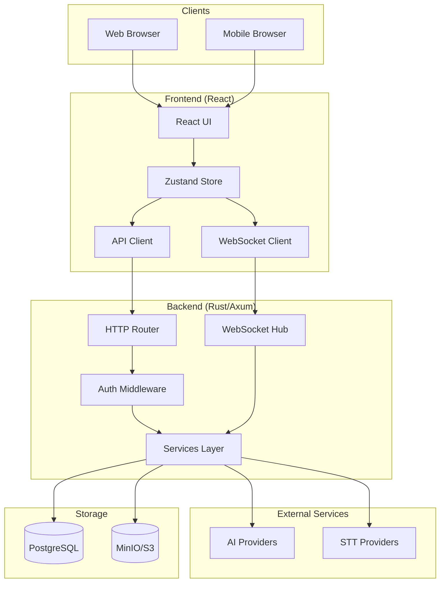
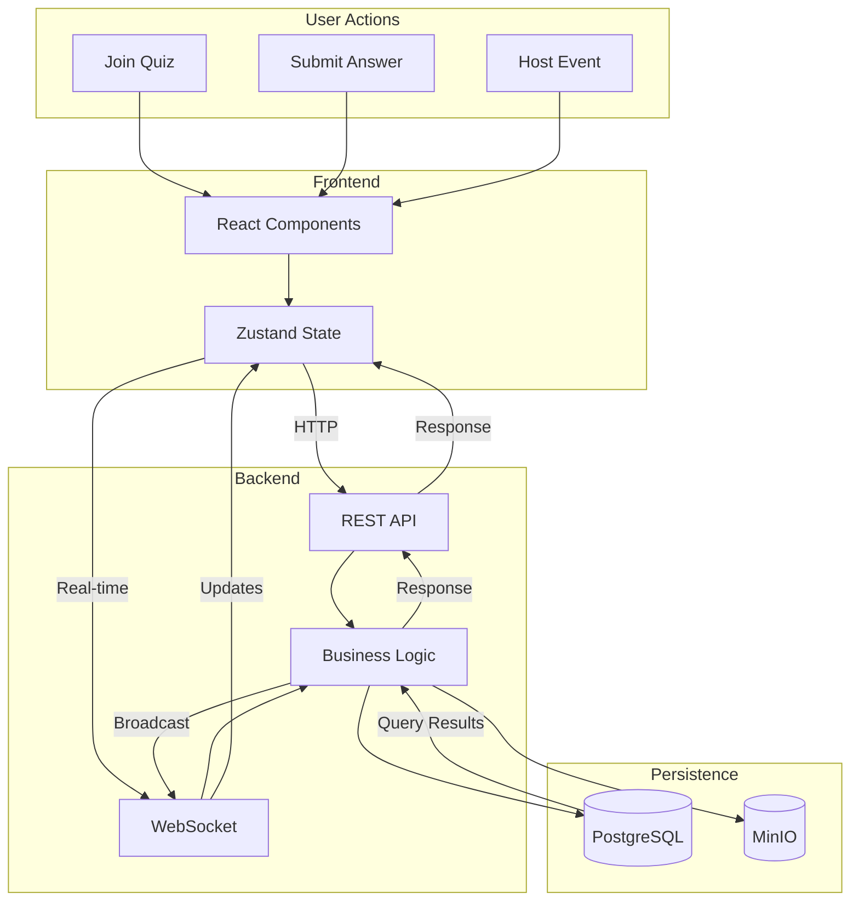
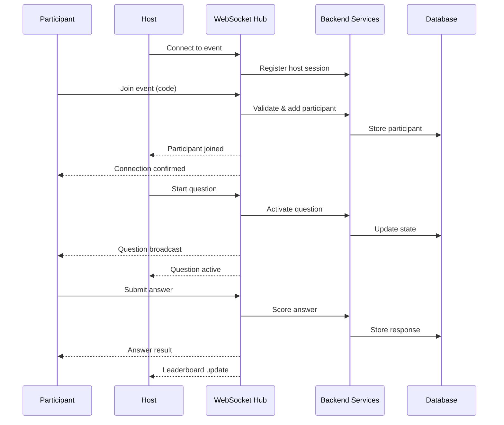
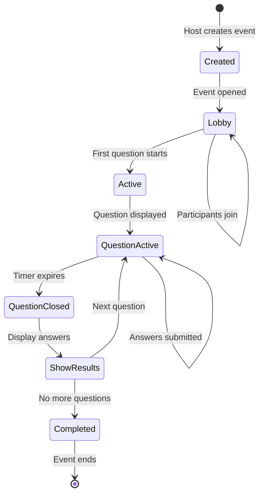
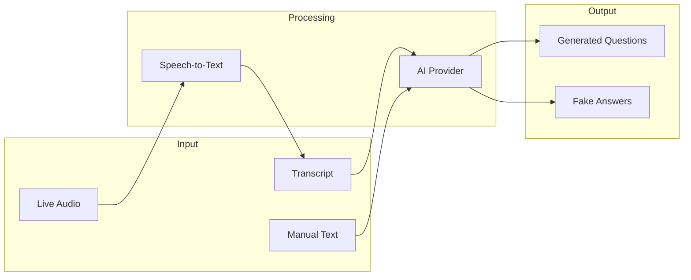
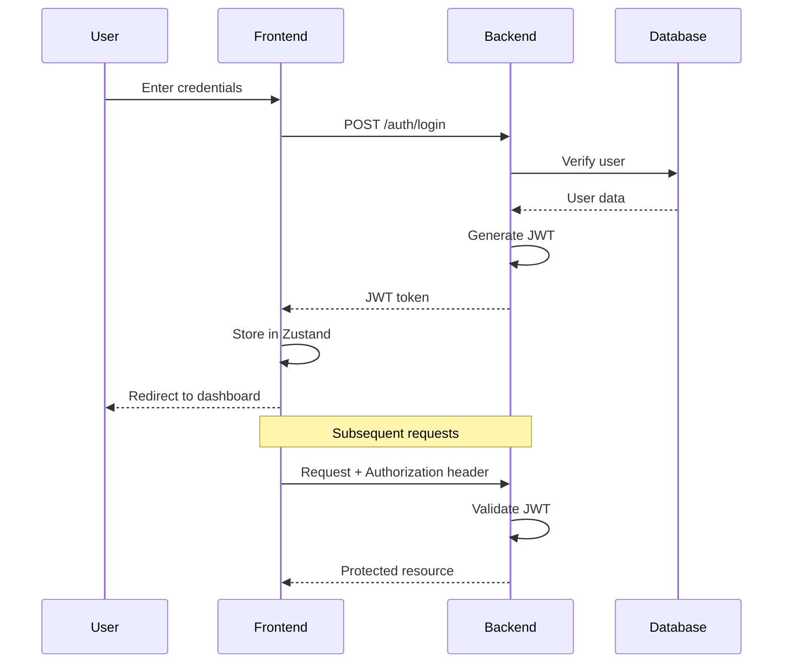
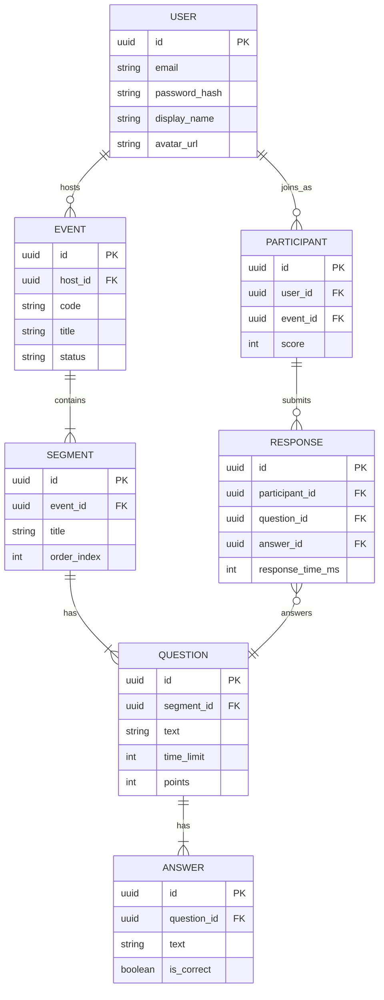
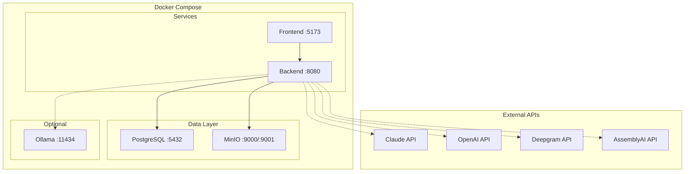

# Architecture Overview

This document provides high-level architectural diagrams for the Quiz App.

## System Overview



## Component Architecture

```mermaid
graph LR
    subgraph Frontend
        Pages[Pages]
        Components[Components]
        AuthStore[Auth Store]
        APIClient[API Client]
    end

    subgraph Backend
        subgraph Routes
            AuthRoutes[/auth]
            QuizRoutes[/quiz]
            EventRoutes[/events]
            SettingsRoutes[/settings]
        end

        subgraph Services
            AIService[AI Service]
            ScoringService[Scoring]
            TranscriptionService[Transcription]
            EncryptionService[Encryption]
        end

        subgraph WebSocket
            Hub[Hub]
            Handler[Handler]
            Messages[Messages]
        end

        subgraph Data
            Models[Models]
            Migrations[Migrations]
        end
    end

    Pages --> Components
    Components --> AuthStore
    Components --> APIClient
    APIClient --> AuthRoutes
    APIClient --> QuizRoutes
    APIClient --> EventRoutes
    APIClient --> SettingsRoutes
    Routes --> Services
    Hub --> Handler
    Handler --> Messages
    Services --> Models
```

## Data Flow



## WebSocket Communication



## Quiz Session Lifecycle



## AI Question Generation Flow



## Authentication Flow



## Database Schema (Simplified)



## Deployment Architecture


