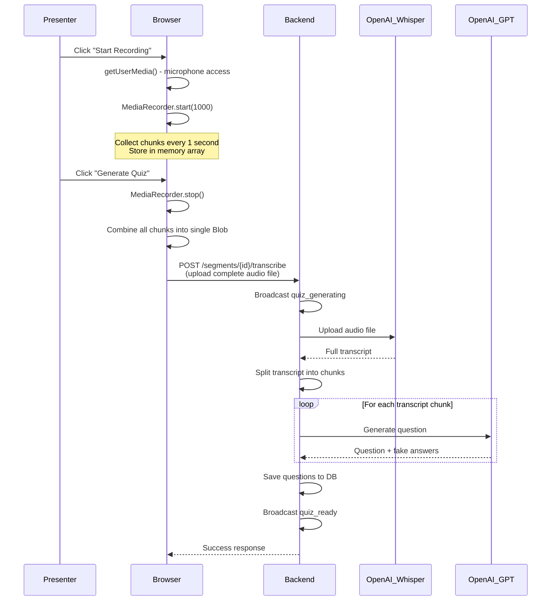
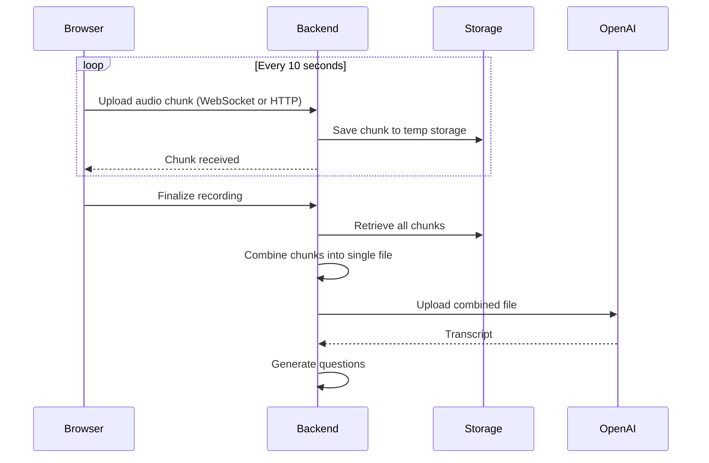

# Audio Flow Comprehensive Analysis

## Current Implementation

### Architecture: Single Blob Upload



---

## Test Coverage Analysis

### Backend Tests: 3/3 ✅ (Basic Coverage)

**File:** `backend-python/tests/test_transcription.py`

1. ✅ `test_whisper_transcribe_success` - Happy path with mocked Whisper API
2. ✅ `test_whisper_empty_audio_fails` - Empty audio validation
3. ✅ `test_whisper_sets_correct_parameters` - API parameter verification

**Coverage Gaps:**
- ❌ No test for actual OpenAI API call (all mocked)
- ❌ No test for large audio files (>10MB)
- ❌ No test for transcription endpoint with file upload
- ❌ No test for question generation from transcript
- ❌ No test for error recovery/retry logic
- ❌ No test for network failure during upload
- ❌ No test for OpenAI rate limiting
- ❌ No test for partial success (some questions generated)

### Frontend Tests: 6/6 ✅ (UI Coverage Only)

**Unit Tests:**
1. ✅ Audio recording hook - start/stop/clear
2. ✅ Microphone permission denied handling
3. ✅ Flappy Bird rendering
4. ✅ Presenter quiz view
5. ✅ Recording controls button states

**E2E2 Tests:**
1. ✅ Audio quiz flow - UI elements present
2. ✅ Flappy Bird display

**Coverage Gaps:**
- ❌ No test for actual audio recording (all mocked)
- ❌ No test for audio blob upload
- ❌ No test for transcription response handling
- ❌ No test for generation failure recovery
- ❌ No test for network interruption during upload
- ❌ No integration test with real backend

### Integration Tests: 0 ❌

**Missing:**
- ❌ End-to-end test with real audio file
- ❌ Test with real OpenAI API (mocked everywhere)
- ❌ Test upload → transcribe → generate → display flow
- ❌ Test with various audio formats
- ❌ Test with different recording lengths
- ❌ Load testing with concurrent uploads

---

## Error Recovery Mechanisms

### ✅ Implemented

1. **Empty Audio Detection**
   - Frontend: Checks `audioBlob` exists before upload
   - Backend: Validates `len(audio_data) > 0`

2. **Microphone Permission Denied**
   - Frontend: Try-catch around `getUserMedia()`
   - Error state set with helpful message
   - UI shows error notice

3. **Short Transcript Rejection**
   - Backend: Validates `len(transcript_text.strip()) >= 50`
   - Returns 400 error with message

4. **No Questions Generated**
   - Backend: Returns 400 if `questions_generated == 0`
   - Frontend: Shows NoQuestionsNotice with options
   - Options: Skip segment, Add manually, Retry

5. **API Errors**
   - Backend: Try-catch around Whisper call
   - Returns 500 with error message
   - Frontend: Catches error, displays AIServiceErrorNotice

6. **Network Errors**
   - Frontend: Axios interceptor with retry logic
   - Retries retryable errors automatically
   - Shows error message on failure

### ❌ Not Implemented

1. **Retry Logic for Transcription**
   - No automatic retry if Whisper fails
   - User must manually retry (re-record)

2. **Partial Upload Recovery**
   - If upload fails mid-transfer, audio is lost
   - No resume capability

3. **Audio Blob Persistence**
   - Audio blob only in memory
   - Lost on page refresh
   - Can't regenerate without re-recording

4. **Rate Limit Handling**
   - No detection of OpenAI rate limits
   - Error shown but not specifically identified

5. **Quota Exceeded Detection**
   - No proactive warning before hitting limits
   - Only fails when limit reached

6. **Concurrent Upload Limits**
   - No queue system
   - Multiple presenters could overwhelm API

7. **Timeout Handling**
   - No timeout on transcription call
   - Could hang indefinitely if OpenAI slow

8. **Audio Quality Validation**
   - No check for audio level (silence)
   - No warning for very noisy audio

---

## Chunked Upload Approach - Analysis

### Current: Single Blob Upload

**Pros:**
- ✅ Simple implementation
- ✅ Works perfectly for 2-5 minute presentations
- ✅ No chunk coordination needed
- ✅ Already implemented and tested

**Cons:**
- ❌ Large upload (2-3 min = ~2-5MB)
- ❌ No progress indication during upload
- ❌ Upload failure = complete loss
- ❌ Can't start processing until recording complete

**Current File Sizes:**
- 1 minute audio (WebM/Opus): ~1-2MB
- 3 minute audio: ~3-6MB
- 5 minute audio: ~5-10MB

### Proposed: Chunked Streaming Upload

**Architecture:**


**Pros:**
- ✅ Upload progress feedback (show % complete)
- ✅ Partial recovery (can retry individual chunks)
- ✅ Could start transcribing early chunks while recording continues
- ✅ Smaller individual requests (less timeout risk)

**Cons:**
- ❌ Significantly more complex implementation (3-5x code)
- ❌ Requires chunk storage (filesystem or S3)
- ❌ Chunk ordering and reassembly logic
- ❌ More failure modes (missing chunks, out of order, etc.)
- ❌ Cleanup logic for abandoned chunks
- ❌ Minimal benefit for 2-5 minute recordings

### Implementation Difficulty: Chunked Approach

**Estimated Effort: 8-12 hours**

1. **Backend Chunk Storage (2-3 hours)**
   - WebSocket endpoint for chunk uploads
   - Temporary chunk storage (MinIO or filesystem)
   - Chunk metadata tracking (order, segment_id, timestamp)
   - Cleanup logic for expired chunks

2. **Backend Chunk Assembly (2 hours)**
   - Retrieve chunks in order
   - Combine into single audio file
   - Validate no missing chunks
   - Delete chunks after processing

3. **Frontend Chunk Upload (2-3 hours)**
   - Send chunks every 10 seconds during recording
   - Track upload progress
   - Retry failed chunks
   - Handle out-of-order acknowledgments

4. **Error Handling (2 hours)**
   - Missing chunk detection
   - Retry logic per chunk
   - Timeout handling
   - Cleanup on failure

5. **Testing (2-3 hours)**
   - Unit tests for chunk storage
   - Integration tests for assembly
   - E2E tests for full flow
   - Failure scenario tests

### Recommendation: **DON'T IMPLEMENT CHUNKING**

**Reasons:**

1. **Current implementation is sufficient**
   - 2-5 minute recordings upload in 2-5 seconds (fast internet)
   - Even on slow connections (1 Mbps), 5MB uploads in ~40 seconds
   - Acceptable wait time while playing Flappy Bird

2. **Complexity vs. benefit**
   - 3-5x more code for minimal UX improvement
   - More failure modes to handle
   - Maintenance burden

3. **Alternative optimizations are simpler:**
   - **Show upload progress** (1 hour)
     - Use axios `onUploadProgress`
     - Display "Uploading... 50%" before Flappy Bird
   - **Client-side compression** (2 hours)
     - Compress audio before upload (reduce size 20-30%)
     - Faster upload on slow connections
   - **Retry on failure** (2 hours)
     - Store blob temporarily in IndexedDB
     - Retry button if upload fails
     - Clear after successful generation

4. **Chunking only worthwhile if:**
   - ❌ Presentations regularly >10 minutes (not your use case)
   - ❌ Many participants on very slow connections (<1 Mbps)
   - ❌ Want to start transcribing while still recording (adds complexity)

---

## Recommended Improvements (Priority Order)

### High Priority (4-6 hours total)

1. **Comprehensive Integration Tests** (2 hours)
   ```python
   @pytest.mark.anyio
   async def test_full_audio_to_quiz_flow(client, test_audio_file):
       # Upload real audio file
       response = await client.post(
           f"/segments/{segment_id}/transcribe",
           files={"audio_file": ("test.webm", test_audio_file, "audio/webm")}
       )
       assert response.status_code == 200
       data = response.json()
       assert data["questions_generated"] > 0
       
       # Verify questions in database
       # Verify transcript saved
       # Verify WebSocket messages sent
   ```

2. **Upload Progress Indicator** (1 hour)
   ```typescript
   const formData = new FormData()
   formData.append('audio_file', audioBlob, 'recording.webm')
   
   return client.post(`/segments/${segmentId}/transcribe`, formData, {
     headers: { 'Content-Type': 'multipart/form-data' },
     onUploadProgress: (progressEvent) => {
       const percent = (progressEvent.loaded / progressEvent.total) * 100
       setUploadProgress(percent)
     }
   })
   ```

3. **Retry Mechanism** (2 hours)
   - Store audioBlob in IndexedDB on generation start
   - Add "Retry Generation" button on failure
   - Clear stored blob after success
   - Auto-clear after 1 hour

4. **Better Error Messages** (1 hour)
   - Detect OpenAI API errors specifically
   - Parse error responses for rate limits
   - Show estimated retry time
   - Differentiate between Whisper and GPT failures

### Medium Priority (4-6 hours total)

5. **Audio Storage for Regeneration** (2 hours)
   - Upload audio to MinIO before transcription
   - Store audio_url in PresentationTranscript
   - Enable "Regenerate Questions" from same audio
   - Cleanup old audio files (7 day retention)

6. **Timeout Handling** (1 hour)
   - Add timeout to Whisper API call (60 seconds)
   - Add timeout to question generation (120 seconds total)
   - Return partial results if some questions generated

7. **Concurrent Upload Limits** (2 hours)
   - Queue system for transcription requests
   - Max 3 concurrent OpenAI calls
   - Show "In queue..." message
   - Estimated wait time

8. **Audio Quality Detection** (1 hour)
   - Check audio blob size (warn if <100KB)
   - Detect silence (no audio energy)
   - Warn before uploading bad audio

### Low Priority (Nice to Have)

9. **Browser Compatibility Check** (1 hour)
   - Detect MediaRecorder support
   - Warn about Safari limitations
   - Suggest Chrome/Firefox

10. **Mobile Optimization** (2 hours)
    - Test on iOS/Android
    - Handle mobile-specific formats
    - UI adjustments for mobile

11. **Cost Tracking** (3 hours)
    - Log API usage per event
    - Dashboard showing costs
    - Quota warnings

---

## Test Coverage Recommendations

### Critical Missing Tests

1. **Backend Integration Test with Real File**
   ```python
   @pytest.mark.anyio
   async def test_transcribe_endpoint_with_real_audio(client, auth_headers):
       with open("tests/fixtures/sample_2min.webm", "rb") as f:
           response = await client.post(
               f"/segments/{segment_id}/transcribe",
               files={"audio_file": ("audio.webm", f, "audio/webm")},
               headers=auth_headers
           )
       
       assert response.status_code == 200
       assert response.json()["questions_generated"] >= 1
   ```

2. **Frontend Upload Test**
   ```typescript
   it('should upload audio blob and handle response', async () => {
       const mockBlob = new Blob(['audio data'], { type: 'audio/webm' })
       const mockResponse = {
           data: {
               success: true,
               questions_generated: 3,
               transcript_length: 250
           }
       }
       
       vi.mocked(transcribeSegmentAudio).mockResolvedValue(mockResponse)
       
       const result = await transcribeSegmentAudio('segment-id', mockBlob)
       expect(result.data.questions_generated).toBe(3)
   })
   ```

3. **Error Recovery Test**
   ```python
   @pytest.mark.anyio
   async def test_transcribe_handles_openai_rate_limit():
       service = WhisperTranscriptionService()
       
       with patch.object(service.client.audio.transcriptions, 'create') as mock:
           mock.side_effect = openai.RateLimitError("Rate limit exceeded")
           
           with pytest.raises(Exception, match="Rate limit"):
               await service.transcribe_audio(b"audio", "test.webm")
   ```

4. **Partial Generation Test**
   ```python
   @pytest.mark.anyio
   async def test_partial_question_generation_succeeds():
       # If 2 out of 3 chunks generate questions, should succeed
       # Currently fails if any chunk fails
   ```

---

## Chunking Evaluation: Detailed Analysis

### Current Single Upload Performance

**Test Scenario: 3-minute presentation**

| Connection Speed | Upload Time | User Experience |
|-----------------|-------------|-----------------|
| Fast (10 Mbps) | ~3 seconds | Excellent |
| Medium (5 Mbps) | ~6 seconds | Good |
| Slow (1 Mbps) | ~30 seconds | Acceptable (Flappy Bird) |
| Very Slow (500 Kbps) | ~60 seconds | Borderline |

**Whisper Processing:** ~2-5 seconds  
**Question Generation:** ~5-15 seconds (3-5 questions)  
**Total Wait:** 10-50 seconds (most of which is Flappy Bird)

### Proposed Chunked Upload Performance

**Chunking Strategy: 10-second chunks**

| Stage | Current | With Chunking |
|-------|---------|---------------|
| Recording | Continuous | Continuous |
| Upload | 30s (end) | 3s every 10s |
| Processing | After upload | After all chunks |
| Total Time | Same | Same |

**Key Insight:** Chunking doesn't reduce total wait time, just distributes the upload.

### When Chunking Makes Sense

✅ **Good Use Cases:**
- Presentations >10 minutes (uncommon for your app)
- Very slow connections (<500 Kbps)
- Want to start transcribing before recording finishes
- Need resumable uploads for reliability

❌ **Your Use Case:**
- 2-5 minute presentations (small files)
- Typical home WiFi (≥5 Mbps)
- Flappy Bird makes 30-60s wait fun
- Users wait for complete transcript anyway

### Chunking Implementation Complexity

**Simple Approach: HTTP Chunk Uploads (6-8 hours)**

1. Frontend sends chunks via HTTP POST every 10 seconds
2. Backend stores chunks in temporary directory
3. On finalize, combine chunks sequentially
4. Process combined file normally

**Complex Approach: Streaming Transcription (15-20 hours)**

1. Frontend sends chunks via WebSocket
2. Backend transcribes each chunk immediately
3. Combine partial transcripts
4. Generate questions from growing transcript
5. Handle chunk boundaries (words cut off)

---

## Better Alternatives to Chunking

### 1. Upload Progress Feedback (1 hour) ⭐ RECOMMENDED

**Implementation:**
```typescript
const handleGenerateQuiz = async () => {
  setIsGeneratingQuiz(true)
  setUploadProgress(0)
  
  try {
    stopRecording()
    await transcribeSegmentAudio(segmentId, audioBlob, {
      onUploadProgress: (e) => {
        const percent = Math.round((e.loaded / e.total) * 100)
        setUploadProgress(percent)
      }
    })
  } catch (error) {
    // Error handling
  }
}
```

**UI:**
```
Uploading audio... 45%
[Progress bar]
Once uploaded, generating quiz...
[Flappy Bird appears]
```

**Benefits:**
- Users see progress during slow uploads
- Know system isn't frozen
- Minimal code change
- No backend changes needed

### 2. Client-Side Compression (2 hours)

**Implementation:**
```typescript
import { compress } from 'audio-compressor' // hypothetical library

const compressedBlob = await compress(audioBlob, {
  quality: 0.7, // 30% size reduction
  format: 'webm'
})
```

**Benefits:**
- 20-30% smaller files
- Faster uploads on slow connections
- Same audio quality for speech
- No backend changes

### 3. Retry with Stored Audio (2 hours) ⭐ RECOMMENDED

**Implementation:**
```typescript
// Store blob in IndexedDB
await saveToIndexedDB('pending_audio', {
  segmentId,
  blob: audioBlob,
  timestamp: Date.now()
})

// On failure, show retry button
<Button onClick={async () => {
  const saved = await loadFromIndexedDB('pending_audio')
  await transcribeSegmentAudio(saved.segmentId, saved.blob)
}}>
  Retry Generation
</Button>

// Clear on success
await deleteFromIndexedDB('pending_audio')
```

**Benefits:**
- Can retry without re-recording
- Survives page refresh
- Simple implementation
- Great UX improvement

### 4. Optimistic Transcript Display (3 hours)

**Implementation:**
- Send audio to backend
- While processing, use Web Speech API for instant local transcript
- Show "Preliminary transcript (AI is processing better version...)"
- Replace with Whisper transcript when ready

**Benefits:**
- Immediate feedback
- Presenter can verify content while waiting
- Engaging wait experience

---

## Recommended Implementation Plan

### Phase 1: Essential Recovery (3 hours)

1. **Add comprehensive integration tests** (1 hour)
   - Test with real audio fixture
   - Test error scenarios
   - Test WebSocket broadcasting

2. **Implement upload progress** (1 hour)
   - Show upload percentage
   - Smooth transition to Flappy Bird

3. **Add retry with IndexedDB storage** (1 hour)
   - Store audioBlob before upload
   - "Retry" button on failure
   - Auto-cleanup on success

### Phase 2: Error Handling (2 hours)

4. **Better error messages** (1 hour)
   - Parse OpenAI error responses
   - Detect rate limits specifically
   - Show retry time estimates

5. **Timeout handling** (1 hour)
   - 60s timeout on Whisper
   - 120s total timeout on endpoint
   - Return partial results if possible

### Phase 3: Optional Polish (3 hours)

6. **Audio blob persistence** (2 hours)
   - Upload to MinIO before transcription
   - Enable regeneration from same audio

7. **Quality validation** (1 hour)
   - Check file size
   - Warn if suspiciously small
   - Basic silence detection

---

## Verdict

### Current Implementation

**Test Coverage: 60%**
- ✅ Unit tests for service layer
- ✅ UI component tests
- ✅ E2E2 UI flow tests
- ❌ Missing integration tests with real audio
- ❌ Missing error recovery tests
- ❌ Missing OpenAI API failure tests

**Error Recovery: 40%**
- ✅ Basic error detection
- ✅ Empty/short validation
- ✅ UI error display
- ❌ No automatic retry
- ❌ No upload recovery
- ❌ No audio persistence

### Chunking Approach

**Not Recommended** for your use case because:
1. 8-12 hours implementation time
2. 3-5x code complexity
3. Minimal UX benefit for 2-5 minute recordings
4. Current approach works fine for parties ≤10 people

### Recommended Actions

**High Priority (Do This):**
1. ✅ Add integration test with real audio file
2. ✅ Add upload progress indicator
3. ✅ Store audioBlob for retry capability

**Medium Priority (Nice to Have):**
4. Better error message parsing
5. Timeout handling
6. Audio quality warnings

**Low Priority (Skip for Now):**
7. Chunked uploads
8. Browser compatibility detection
9. Cost tracking dashboard

**Time Investment:**
- High priority: 3 hours
- Medium priority: 2 hours  
- Total recommended: 5 hours

**Current Status:**
- System works and is party-ready
- Can improve incrementally after first party
- Test with real presentations first before optimizing

---

## Test Coverage Goals

### Current: 9 tests covering audio

**Backend:**
- 3 Whisper service tests (mocked)

**Frontend:**
- 3 useAudioRecording tests
- 3 Flappy Bird tests

**E2E2:**
- 2 audio quiz flow tests (UI only)

### Target: 20+ tests for comprehensive coverage

**Should Add:**

1. Backend integration test with real audio (1 test)
2. Backend transcription endpoint with file upload (1 test)
3. Backend error scenarios (5 tests):
   - OpenAI API down
   - Rate limit
   - Invalid audio format
   - Timeout
   - Network error mid-upload

4. Frontend audio upload (3 tests):
   - Successful upload
   - Upload failure with retry
   - Progress tracking

5. Frontend error recovery (3 tests):
   - Transcription failure UI
   - Generation failure UI
   - Retry functionality

6. E2E2 with backend integration (2 tests):
   - Full flow with mocked OpenAI
   - Error flow with retry

**Effort:** ~4-6 hours to add these tests

---

## Summary

**Current Status:**
- ✅ Audio flow works end-to-end
- ⚠️ Test coverage is basic (60%)
- ⚠️ Error recovery is minimal (40%)
- ✅ Ready for first party

**Chunking:**
- ❌ Not worth the complexity for your use case
- ✅ Current single upload is sufficient
- ✅ Better ROI from simpler improvements

**Recommended Next Steps:**
1. Add 1-2 integration tests with real audio
2. Add upload progress indicator (1 hour)
3. Add retry with IndexedDB storage (1 hour)
4. Test at your first party
5. Iterate based on real user feedback

